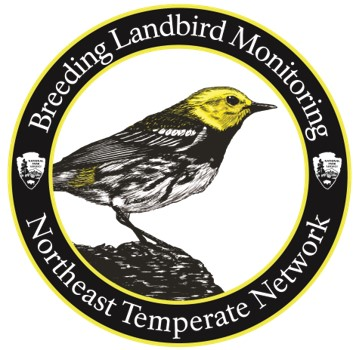

---
output:
  html_document:
    fig_caption: yes
---
      
```{r setup, include=FALSE}
knitr::opts_chunk$set(echo = FALSE)
# load in packages
library(magrittr)
library(devtools)
library(tidyverse)
library(NCRNbirds)
library(leaflet)
library(cowplot)
library(readxl)
library(lubridate)
library(plotly)

network<-"NETN"
Park<-"MORR"
year <- 2019
points<-NA
bcr<- c("28")
BCRName<-"Appalachian"
# load in data
BirdData <- importNETNbirds("./Data/NETN") # needs to be fixed if multi-network
tlu_GuildRatings <- read_excel("./Data/tlu_GuildRatings.xlsx")

# model data
#The file "spMeanTrends.csv" contains the data used to generate the trends in abundance for each species across the study years.It contains the estimated trend in species abundance after accounting for imperfect detection and effects of forest covariates. 

spMeanTrends <- read.csv("./Data/spMeanTrends.csv") %>% 
  pivot_longer(cols= 3:11, names_to = "park") %>% 
  add_column(variable = "Trend Estimate") %>% rename(Year = years, AOU_Code= species) %>% 
  dplyr::filter(park == Park)

#import in Doser et al. 2020 trend estimates per species
spMeanYearEffect <- read.csv("./Data/spMeanYearEffect.csv") %>% 
   pivot_longer(cols= 3:11, names_to = "park", values_to ="value") %>% 
  pivot_wider(id_cols=  c(park, species), names_from = "type", values_from= "value" ) %>% 
  rename(AOU_Code= species) %>% 
  dplyr::filter(park == Park)

guildsMeanTrends <-read.csv("./Data/guildsMeanTrends.csv") # guild-level annual model estimates

guild_tlu<-getGuilds(BirdData) %>% filter( BCI_Type == "Cent_Appal")%>% rename(Species_Guild = AOU_Code)

pointCommunity <- read.csv("./Data/point-rich-bci-by-year.csv")
 
ParkCommAnnual <- read.csv("./Data/park-rich-bci-by-year.csv")
 
ParkList<-NCRNbirds::getParkNames(BirdData, name.class="code")

PIFSppByBCR<- read.csv("./Data/PIF_Species_BCR.csv") %>% 
  filter(BCR %in% bcr)

# derive raw detects and add on modeled estimates
sp_detects<- SumRelAbund(BirdData[ParkList == Park], band = 1:2, max= T)%>% # raw detection data created from SumRelAbund
  add_column(variable = "Field Observation") %>% select(park= Admin_Unit_Code, Year,  AOU_Code, value= RelAbund, variable) %>% 
  bind_rows(spMeanTrends)


minYear<-min(getBirds(BirdData[ParkList == Park])$Year)
maxYear<-max(getBirds(BirdData[ParkList == Park])$Year)

```

Recent trends in bird monitoring at `r getParkNames(BirdData[ParkList == Park], name.class = "long")` {.tabset .tabset-fade}
------------------------------------
### Overview
<div style="float:right;position:relative;top:10px;padding:5px 5px 5px 10px;margin:0px 5px 10px 5px">
```{r Effmap, echo = FALSE,  fig.height=6, fig.width= 6, fig.align = 'left', fig.caption = "Map of monitoring effort at permanent sites", warning= FALSE, comment=FALSE, message=FALSE}
NCRNbirds::mapEffort(BirdData[ParkList == Park], palette = "viridis", title = paste0("Total surveys since ",minYear))
```
</div>
<h3> Long-term forest bird monitoring program </h3>

<p> The Northeast Temperate Network's (NETN) breeding bird monitoring program has been implemented since 2006 in partnership with the <a href="https://vtecostudies.org/">Vermont Center of Ecostudies</a> and many volunteer birders. The program was established to determine status and trends in species composition of breeding landbirds in the park. </p>

<p>This report summarizes park-level forest bird monitoring results between `r minYear` and `r maxYear` in `r Park` for the following topics:</p>
<ul>
 <li> <b>[Bird Diversity]:</b> Summary of the number of species detected since `r minYear` and across monitoring sites.</li> 
 <li> <b>[Bird Community Index]:</b> Summary of the condition of the park's forest bird community.</li> 
 <li> <b>[Species trends]:</b> Summary of bird abundance over time for a variety of selected species. </li> 
 <li> <b>[Conclusions]</b>: Summary of results in the context of park forest health. </li>
 <li> <b>[Supporting Resources]:</b> List of references and associated documentation for the bird monitoring program.</li> 
 </ul>

<h3>Methods</h3>

<p> The analysis in this report is based on repeated visits to  permanent monitoring sites shown in the map to the right. Each point is typically visited once a year but occasionally twice, during the late spring to mid-summer during peak breeding. At each visit all birds heard or seen during a 10-minute period are recorded. Additionally, the observers indicate an approximate distance to the bird, for example, within 10 meters (~33 feet) or further. For detailed information on the methods and analysis, please consult the [Supporting Resources]. </p>

<p> If you have questions about this program, report, or would like to acquire data or speak about bird monitoring in your park please contact NETN staff  <a href="mailto:ed_sharron@nps.gov"> Ed Sharron (Bird Volunteer Coordinator)</a>,  <a href="mailto:adam_kozlowksi@nps.gov"> Adam Kozlowski (Data Manager)</a>, or <a href="mailto: aaron_weed@nps.gov"> Aaron Weed (Program Manager)</a>.</p>

### Bird Diversity {.tabset}

<p>  The number of detected species (or species richness) is a key metric from our monitoring because it provides a straight-forward indication of the bird diversity using `r Park` as breeding habitat during the summer. The number of species may change over time due to many factors affecting the local area surrounding the park's forest (e.g., weather, forest cover, understory vegetation) or factors affecting bird populations at greater geographic scales, such as trends in regional forest structure (Holmes and Sherry 2001) and wintering habitat survival. </p> 

#### No. of Species over time

<p> The plot below shows the number of bird species detected during monitoring each year (blue) and the number of species estimated after accounting for imperfect detection (green, see Doser et al. 2021). Note that this plot is not showing the total number of bird species in the park, as other species may be present but not detected during monitoring.</p>

```{r richness, echo = TRUE, echo=FALSE, fig.height=4, fig.width= 10, fig.align = 'center', fig.cap= "Figure 1. Observed (blue) and estimated (green) species richness over time. Data are summarized to include detections within 100 meters of the observer."}

plotdata<- dplyr::filter(ParkCommAnnual, park == Park) %>% select(Year= year, `Estimated Richness` = median.rich, low = low.95.rich, hi = high.95.rich) %>% 
  left_join(., NCRNbirds::birdRichness(BirdData[ParkList == Park], band= 1:2, byYear = TRUE), by = "Year") %>% dplyr::rename(`Observed Richness` = Richness) 

colors<- c("Field Observation" = "#2171b5","Estimated (95% C.I.)"= "dark green")
 
GraphOut<-ggplot(data=plotdata, aes(x = Year))+expand_limits(y=0)+
      geom_ribbon(data= plotdata, aes(ymin= low, ymax= hi), fill= "grey95", outline.type = "both")+
      geom_point(aes(y= `Estimated Richness`, color = "Estimated (95% C.I.)"),  size=2)+geom_line(aes(y= `Estimated Richness`, color = "Estimated (95% C.I.)"))+
      geom_point(aes(y= `Observed Richness`, color= "Field Observation"), size=2) + geom_line(aes(y= `Observed Richness`, color= "Field Observation"))+
      theme_classic()+  
      theme(axis.title.y =element_text(size = 14, face ="bold", vjust= 1))+
      theme(axis.title.x =element_text(size = 14, face ="bold", vjust= 1))+
      theme(axis.text.y = element_text(color="black", vjust= 0.5,size = 12))+
      theme(axis.text.x = element_text(color="black", size = 12))+
      scale_color_manual(values = colors)+
      scale_x_continuous(breaks = seq(2006, 2019,2))+
      labs(y=" Number of Species" ,x= "", color = "")+theme(legend.position = c(0.8,0.2))+ theme(legend.text = element_text(size = 14))

ggplotly(GraphOut)

```

<p> <b>There are two main take-home messages related to bird diversity from our monitoring thus far: </b> </p> 
<ul>
<li> The number of species has remained <b> unchanged </b> between `r minYear` to `r maxYear` in `r Park` (Figures 1 and 2). A total of 
`r NCRNbirds::birdRichness(BirdData[ParkList == Park])` species has been detected with an average of `r NCRNbirds::birdRichness(BirdData[ParkList == Park], byYear = TRUE) %>% dplyr::pull(Richness) %>% mean() %>% round(0)` species detected per year. It is important to note that the number of species <i>estimated</i> as shown in the graph (green) is typically higher than the number actually detected during monitoring (blue) because not all birds may have been detected during the survey due to imperfect detection (e.g., bird is present but not heard). </li> 

<li> Figure 2 below shows trends in <i>estimated</i> species richness among all `r network` parks. While the number of forest bird species in `r Park` has not changed, it is one of 4 `r network` parks showing a slight (but non-significant) decline in estimated species richness over time. Species richness at `r Park` ranks as #7 among the 11 `r network` parks monitored (Figure 3). </li>
</ul>


```{r, richTrend, echo=F, fig.cap='Figure 2. Trends in estimated park-level species richness from 2006-2019 at each park. Points are the average species richness across all sites, gray regions denote the 95% credible intervals. Inset text is the median (95% credible interval) linear trend estimating change per year in species richness (Doser et al. 2020).'}
knitr::include_graphics("Fig4.jpg")
```


```{r, richPark, echo=F, fig.cap= "Figure 3. Total number of species detected during surveys since monitoring began"}

# rank order for species richness among parks
plotdata<-NCRNbirds::birdRichness(BirdData, byPark =T) %>% arrange(desc(Richness)) %>% mutate(order= row_number()) %>% mutate(Admin_Unit_Code = fct_reorder(Admin_Unit_Code, order)) %>% mutate(highlight= if_else(Admin_Unit_Code == Park,"yes","no"))

GraphOut<-ggplot(data=plotdata, aes(x=reorder(Admin_Unit_Code,Richness), y= Richness, fill= highlight))+geom_bar(stat = "identity", width=0.75)+
 scale_fill_manual(values =c("#2171b5","red"), guide=FALSE)+
  coord_flip()+
  theme_classic()+  
      theme(axis.title.x =element_text(size = 14, face ="bold"))+
      theme(axis.text.y = element_text(color="black", size = 12))+
      theme(axis.text.x = element_text(color="black", size = 12))+
      labs(x="", y="Total Number of Species Detected")+
  theme(legend.position = "none") 


ggplotly(GraphOut)
```

#### No. of Species among sites

<div style="float:right;position:relative;top:10px;padding:5px 5px 5px 10px;margin:0px 5px 10px 5px">
```{r richmap, echo = FALSE,  fig.height=6, fig.width= 6, fig.align = 'left', warning= FALSE, comment=FALSE, message=FALSE, fig.cap= "Map of Species Richness at permanent sites"}
mapRichness(BirdData[ParkList == Park], title = "No. of species", palette = "viridis", band = 1:2)
```
</div>

This map shows the cumulative total number of species observed during field surveys at each site since `r minYear`.

<p> While no formal analysis has been completed, this map suggests that more species have been detected in the western area of the park, specifically along the Soldier's Huts Route. </p>

### Bird Community Index {.tabset}

<p> The Bird Community Index (BCI- O'Connell et al. 1998, 2000) is an index designed to indicate the conservation status of the bird community in forested areas such as those in `r network` parks. It was developed for conservation of forest birds common within the Central Appalachian region but our analyses indicate that it is also applicable to and helpful for characterizing breeding birds in `r network` parks because of the similarity of species. To calculate the BCI, the list of birds from each site is considered separately. If a site has many bird species that are typically restricted to intact forest areas (&quot;forest obligates&quot;) the site gets a high score, whereas birds that live in a variety of areas (&quot;generalists&quot;) give a site a low score.</p>

<p> Many factors are used to assess the
degree to which a bird species is a generalist or a forest obligate. These
include: </p>
<p>
<ul>
 <li>What habitat does the species prefer?</li>
 <li>Is the species restricted to the interior of forests?</li>
 <li>Where does the species nest (trees, shrubs, ground, etc)?</li>
 <li>What does the species eat (insects in bark, insect on the ground, omnivore,etc)? </li>
 <li>Is the species a predator or parasite of other bird's nests?</li>
 <li>Is the species exotic?</li>
 <li>Is the species a park resident year-round or does it migrate?</li>
 <li>How many broods does the species raise per year?</li>
</ul>
</p>
<p>Based on these assessments each survey site is assigned a score. The scores are then averaged for the entire park in each year.
This average score is used to categorize the bird community of the park as either Low, Medium, High or Highest Integrity. </p>

#### BCI over time

Figure 4 shows that the BCI rating at `r Park` has remained relatively unchanged since `r minYear` and is considered to be of "High Integrity' compared to other bird communities within the Central Appalachian region. 

<div style="float:right;position:relative;top:10px;padding:1px 1px 1px 1px;margin:0px 5px 10px 5px">
```{r BCI, echo=FALSE, fig.height=4, fig.width= 8, fig.align = 'center',fig.cap= "Figure 4. Average annual Bird Community Index across park. Data above are summarized from field observations within 100 meters of the observer. The horizontal axis indicates the year, with the number of points monitored by visit in parenthesis.", message=FALSE}
NCRNbirds::BCIPlot(BirdData[ParkList == Park], type= "Cent_Appal",  plot_title = "", band = 1:2, caption = FALSE)

```

</div>

#### BCI across park
Bird Community Index ratings for permanent monitoring sites in `r year` are shown below across `r Park`. Similar to species richness, BCI is highest in the western portion of the park on the Soldier's Huts route.

```{r BCIrichmap, echo = TRUE, echo=FALSE, fig.height=6, fig.width= 10, fig.align = 'center', message=FALSE}
mapBCI(BirdData[ParkList == Park], band =2, type= "Cent_Appal", years = 2019)
```

Data in the map are summarized from field observations within 100 meters of the observer. The points on the map denote the BCI rating for sites monitored during `r year`. Clicking on the site displays the unique site name and the BCI rating.


#### BCI compared to other parks

As of `r maxYear`, `r Park` has the 4th highest BCI rating in `r network` (Figure 5). The trend analysis concluded that trends in overall bird abundance are declining the fastest in parks with the highest BCI rating (Doser etal. 2021) (Figure 6).   

```{r, BCIPark, echo=F, fig.height=4, fig.width= 8, fig.align = 'center', fig.cap= "Figure 5. Average BCI score per park since monitoring began"}

BCIPark<- map(BirdData, ~BCI(.x))

parkdata<-BCIPark %>% map("BCI")%>% map_dbl(mean) %>% round(1) 

plotdata<- data.frame(Admin_Unit_Code= ParkList, BCI=parkdata)

plotdata<- plotdata  %>% arrange() %>% 
  mutate(order= row_number()) %>% mutate(Admin_Unit_Code = fct_reorder(Admin_Unit_Code, order)) %>% mutate(highlight= if_else(Admin_Unit_Code == Park,"yes","no"))

GraphOut<-ggplot(data=plotdata, aes(x=reorder(Admin_Unit_Code,BCI), y= BCI, fill= highlight))+geom_bar(stat = "identity", width=0.75)+
 scale_fill_manual(values =c("#2171b5","red"), guide=FALSE)+
  theme_classic()+  
      theme(axis.title.x =element_text(size = 14, face ="bold"))+
      theme(axis.text.y = element_text(color="black", size = 12))+
      theme(axis.text.x = element_text(color="black", size = 12))+
      labs(x="", y="Average BCI score")+
  theme(legend.position = "none") 


ggplotly(GraphOut)
```
<p>

```{r, BCITrend, echo=F, fig.cap="Figure 6. Relationship between the estimated slope in bird abundance over time for each park and the average BCI at each park (Doser et al. 2021). The y-axis, median year effect, is the estimated change in bird abundance per point per year. Values below 0 indicate declining bird abundance. Vertical lines represent the 95% CI for the slope and horizontal lines represent the 95% CI for the BCI. Inset text is the estimated Pearson’s correlation coefficient (with 95% CI)."}
knitr::include_graphics("trendBCIRelationship.jpg")
```

### Species trends {.tabset}

Monitoring the status and trends of breeding bird in `r network` parks is a primary objective for the program. We assess population status and trends based on the abundance of each species detected over time. The tabs below illustrate the status and trends of the most common species encountered in `r Park`.

#### Relative Abundance

<p> Relative abundance, expressed as the average number of birds detected per point per visit, provides an indication of how common a particular species is detected during monitoring and reflects its population status in the park. Figure 7 shows that from `r minYear` to `r maxYear`, the forest specialists Wood Thrush, Ovenbird, Veery, and Red-Eyed Vireo are some of the most commonly detected species in `r Park`. Other common species include Blue Jay, American Robin, and Tufted Titmouse.</p>

<p> Bird Conservation Regions (BCRs) are ecologically distinct regions in North America with similar bird communities (www.nabci-us.org). While `r Park` is within the northern portion of Appalachian Mountains BCR it is also near the northern extent of the Piedmont BCR. Within each BCR, species of regional conservation importance have been designated based on rankings by Partners in Flight (Panjabi et al. 2020). Eleven songbird species of regional conservation concern within these BCRs have been detected at `r Park`, including Acadian Flycatcher, Black-and-white Warbler, Canada Warbler, Eastern Towhee, Eastern Wood-Pewee, Louisiana Waterthrush, Northern Flicker, Rose-breasted Grosbeak, Scarlet Tanager, Wood Thrush, and Yellow-billed Cuckoo. Of these, 6 are among the 10 most abundant species detected (Figure 7). </p>

```{r top20,echo=FALSE,results='hide',fig.keep='all', cache= FALSE,  fig.height=6, fig.width= 8, fig.align = 'center', message=FALSE,warning = FALSE, comment=NA}

aou<-SumRelAbund(BirdData[ParkList == Park], max=T, sort=TRUE, abund = 20, band = 1:2)$AOU_Code # get Top 20 most abundant species (birds/point)
  
spp<-getBirdNames(BirdData[ParkList == Park], names= aou , out.style = "common") %>% 
    bind_cols(.,aou ) %>% tibble() %>% rename(common = 1, AOU_Code =2)
      
plotdata<-SumRelAbund(BirdData[ParkList == Park], max=T, AOU = aou, band = 1:2, CalcByYear =FALSE ) %>% 
  group_by(AOU_Code) %>% 
  summarise(mean = round(mean(RelAbund,na.rm=T),2), se = sd(RelAbund)/sqrt(n()), n= n()) %>% 
  left_join(spp,., by = "AOU_Code") %>% 
  left_join(.,PIFSppByBCR, by= "AOU_Code") %>% # add PIF Designations
  mutate(PIF=  if_else(Regional.Importance == 1,"*","")) %>% 
  mutate(common2 = if_else(is.na(PIF), common, paste(PIF,"",common))) %>% 
  mutate(common2 = fct_reorder(common2, mean))
  

BarChart<-ggplot(data= plotdata, aes(x=reorder(common2,mean), y = mean)) +
geom_bar(fill="#2171b5", stat="identity",width=0.75) +
#geom_errorbar(aes(ymin= mean-se, ymax= mean +se), width = .2, color = "#2171b5")+
coord_flip()+
geom_text(aes(label = sprintf("%0.2f", round(mean, digits = 2))), hjust = -0.15, color = "black", size = 4)+
scale_y_continuous(expand = c(0,0),limits = c(0, max(plotdata$mean*1.1)))+ #set origin at 0, sets width of x axis
xlab("") + labs(title = paste0("Abundance of the 20 most commonly detected species in ", Park))+
ylab("Average number of birds detected per point per visit")+ 
theme_classic()+
theme(axis.text.y = element_text(color="black",size = 12))+
theme(axis.text.x = element_text(color="black",size = 12))+
theme(axis.title.x = element_text(color="black",size = 12, face= "bold"))

BarChart
```

Figure 7. Relative abundance of the 20 most commonly detected species. Data in the above graph are summarized within 100 meters from the observer. Relative abundance is calculated as the maximum number of detections per species among visits in a year divided by the number of points monitored from `r minYear` to `r maxYear`. Asterisks next to a species name denote species designated by Partners in Flight to be of conservation importance within the `r BCRName` BCR (Panjabi et al. 2020).

#### Trends over time

<div style="float:right;position:relative;top:10px;padding:5px 5px 5px 10px;margin:0px 5px 10px 5px">
```{r top10trend,echo=FALSE,results='hide',fig.keep='all', cache= FALSE,  fig.height=4, fig.width= 6, fig.align = 'right', message=FALSE,warning = FALSE, comment=NA, fig.cap= "Figure 8. Trends in abundance of top 10 common species."}

aou<-SumRelAbund(BirdData[ParkList == Park], max=T, sort=TRUE, abund = 10, band = 1:2)$AOU_Code # get Top 20 most abundant species (birds/point)
  
spp<-getBirdNames(BirdData[ParkList == Park], names= aou , out.style = "common") %>% 
    bind_cols(.,aou ) %>% tibble() %>% rename(common = 1, AOU_Code =2)%>% 
    mutate(order= row_number())
      
# check number of species detected in park against PIF checklist

PIFinPark<- getChecklist(BirdData[ParkList == Park], out.style = "AOU", band=1:2) %>% 
  tibble() %>% rename(AOU_Code = 1) %>% 
  left_join(PIFSppByBCR,., by="AOU_Code")


plotdata<-filter(spMeanYearEffect, AOU_Code %in% aou) %>% 
   left_join(spp,., by = "AOU_Code") %>% 
    mutate(common = fct_reorder(common, order)) %>% 
    mutate(common = paste0(common, " (", order,")")) %>% 
  left_join(.,PIFSppByBCR, by= "AOU_Code") %>% # add PIF Designations
  mutate(PIF=  if_else(Regional.Importance == 1,"*","")) %>% 
  mutate(common2 = if_else(is.na(PIF), common, paste(PIF,"",common))) %>% 
  mutate(common2 = fct_reorder(common2, mean))

BarChart<-ggplot(data= plotdata, aes(x=common2, y = mean)) +
geom_bar(fill="#2171b5", stat="identity",width=0.75) +
geom_errorbar(aes(ymin=lowCI, ymax= highCI), width = .2, color = "black")+
coord_flip()+ 
#geom_text(aes(label = sprintf("%0.2f", round(mean, digits = 2))), y = plotdata$mean, hjust= 1, vjust= 1,color = "black", size = 4)+
#scale_y_continuous(expand = c(0,0),limits = c(0, max(plotdata$mean*1.1)))+ #set origin at 0, sets width of x axis
xlab("") + labs(title = "")+
ylab(paste("Birds per point per year", "\u00B1", " 95% C.I."))+ 
theme_classic()+
theme(axis.text.y = element_text(color="black",size = 12))+
theme(axis.text.x = element_text(color="black",size = 12))+
theme(axis.title.x = element_text(color="black",size = 12, face= "bold"))+
  geom_hline(yintercept= 0, col= 1)+
  theme(panel.grid.major.x = element_line(color="grey",linetype = "dashed"))+
      theme(panel.grid.major.y = element_line(color="grey", linetype = "dashed"))

BarChart
```
</div>

##### <b>Top 10 most abundant species</b>

<p> Figure 8 shows the trend estimates between `r minYear` and `r maxYear` for the top 10 most abundant species in `r Park` based on a model using time to first detection within the 10-minute point count (Doser et al. 2021). The rank order of abundance in the park is denoted in parentheses following the species name.  Populations are stable when the trend estimate error bars, or credible intervals (C.I.), do not overlap zero (e.g. Eastern Wood-Pewee). Refer to Figure 10 in [Plots of Species Abundance] section to see annual counts over time for these species. </p>

<p>None of the most abundant songbirds detected in `r Park` have increased over time since `r minYear` but 6 common species appear to be stable based on the monitoring data. However, Scarlet Tanager, American Robin, Blue Jay, and Tufted Titmouse have declined significantly during `r minYear ` - `r maxYear `. Other species of regional conservation importance (denoted by *) such as Eastern Wood-Pee Wee, Wood Thrush, Eastern Towhee, and Ovenbird appear to be stable.</p>
<p>

##### <b>Across the network</b>

<p> Trends in the abundance of all species combined across the network did not change over time (Figure 9A) but the trend varied widely across parks (Figure 9B). For instance, the number of birds detected across all species has declined in 3 parks (ACAD, MABI, and MORR) while in SARA, ROVA, and WEFA it has increased over time. Abundance of all species detected in SAGA and MIMA remained the same during this time period. </p>

<p> In parks with significant decreasing or increasing trends, most species generally showed a similar trend to the overall park trend, but typically only a fraction of the species-specific trends were significantly different from zero. For example, while monitoring data suggest that 46 species are in decline at `r Park`, only 9 of these were actually significant trends. However, in parks where abundance has remained constant, there tended to be a split in the direction of the trends among species (e.g., SAGA and MIMA, Figure 9C) with most trends being non-significant.</p>

<p> In `r Park`, the abundance of most species between `r minYear` to `r maxYear` appears to be in decline(Figure 9C). Nine species were estimated to have declined in the park while Northern Flicker increased significantly during monitoring. The overwhelming majority of species showing a decline at `r Park` is concerning, but species-specific trends need further evaluation since for some species declines may occur due to natural forest succession (Holmes and Sherry 2001 ) whereas others may be negatively impacted by human-caused stressors such as forest fragmentation and invasive species. </p>

```{r, NETNtrends,echo=F, fig.cap= "Figure 9. Trends in bird abundance from 2006-2019. Panel (a) shows the linear trend of year across the entire network with the 95% credible interval in parentheses. The trend estimates represent the average change in abundance per point <strong>every four years</strong>. Error in the trend estimate is denoted in parentheses. Abundance is stable when the interval does not overlap zero. Panel (b) shows the park level trends. Red highlight indicates a significant negative year trend, white highlight indicates no significant trend, and blue highlight indicates positive significant trend. Panel (c) shows the number of species with linear trend of year estimates that are negative (red) and positive (blue) within each park. The number of species with significant trends is shown in boldface in parentheses. From Doser et al. (2021)."}
knitr::include_graphics("Fig3.jpg")
```


#### Plots of Species Abundance

Below are the average annual counts with  trends when significant (Doser et al. 2021) for the top 10 most abundant species detected since `r minYear` across `r Park` over time. Plots show the average annual abundance of bird observations within 100 meters of the observer among sites. During years when a site was surveyed more than once, the plotted average is calculated from the maximum count per survey visit in a year. The estimate of the trend  (with 95% C.I.) is denoted in the upper right of each panel. If the interval does <ins>not</ins> contain zero the trend is statistically significant over time  and plotted for that species (e.g., Blue Jay). Rank order of abundance is denoted in parentheses following each species name. 

<div style="float:right;position:relative;top:10px;padding:5px 5px 5px 10px;margin:0px 5px 10px 5px">
```{r Top10TrendPlots,echo=FALSE,results='hide',fig.keep='all', fig.height=16, fig.width= 10, fig.align = 'center', message=FALSE,warning = FALSE, comment=NA, fig.cap= "Figure 10. Average annual counts and significant trends over time (line) for the top 10 most abundant species detected across the park." }

#Get Top 10 species
aou<-SumRelAbund(BirdData[ParkList == Park], max=T, sort=TRUE, abund = 10, band = 1:2)$AOU_Code

spp<-getBirdNames(BirdData[ParkList == Park], names= aou , out.style = "common") %>% 
    bind_cols(.,aou ) %>% tibble() %>% rename(common = 1, AOU_Code =2) %>% 
    mutate(order= row_number())

#subset sp_detects    

plotdata<-
   left_join(spp,sp_detects, by = "AOU_Code") %>% 
    mutate(common = paste0(common, " (", order,")")) %>% 
    mutate(common = fct_reorder(common, order)) %>% 
   left_join(.,spMeanYearEffect, by= c("AOU_Code","park")) %>% 
    group_by(common) %>% 
    mutate(Nonsig= between(0,lowCI,highCI)) %>% # determine in CI contains 0; returns TRUE
    filter(AOU_Code %in% aou) 

GraphOut<-ggplot(data=plotdata, aes(x = Year, y = value, color = variable))+expand_limits(y=0)+
      geom_point(data= dplyr::filter(plotdata, variable == "Field Observation"),size=2) + 
      geom_line(data= dplyr::filter(plotdata, variable == "Field Observation"))+
      geom_line(data = filter(plotdata, Nonsig == FALSE & variable == "Trend Estimate")) +
      #geom_errorbar(aes(ymin= mean-se, ymax= mean +se), width = .2, color = "#2171b5")+
      theme_classic()+
      theme(axis.title.y =element_text(size = 14, face ="bold", vjust= 1))+
      theme(axis.title.x =element_text(size = 14, face ="bold", vjust= 1))+
      theme(axis.text.y = element_text(color="black", vjust= 0.5,size = 12))+
      theme(axis.text.x = element_text(color="black", size = 10))+
      scale_x_continuous(breaks = seq(2006, 2019,2))+
      scale_color_manual(values = c("#2171b5", "dark green"))+
      labs(y="Number detected per point" , color = "")+
      theme(legend.position = "top")+ 
      theme(legend.text = element_text(size = 12))+
       theme(panel.background =  element_rect(fill="white", colour="black")) +
       theme(plot.title=element_text(size=12, vjust=2, face= "bold")) +
       theme(strip.background= element_rect(size=10, color="gray", linetype ="solid" ))+
      theme(strip.text=element_text(size=12, vjust=0, face= "bold"))+
      facet_wrap(~common, ncol = 2, shrink= FALSE)

GraphOut+
  geom_text(data= dplyr::filter(plotdata, variable == "Trend Estimate")  %>% distinct(common, park, variable, mean, lowCI, highCI), show.legend = FALSE, aes(x = Inf, y = Inf, label = paste(round(mean,2)," (",round(lowCI,2),",",round(highCI,2),")"), hjust = 1.05,vjust   = 1))

```
</div>

### Conclusions
<div style="float:right;position:relative;top:10px;padding:5px 5px 5px 10px;margin:0px 5px 10px 5px">
```{r conc,echo=FALSE,fig.keep='all', cache= FALSE,  fig.height=4, fig.width= 6, fig.align = 'right'}

```
</div>

The NETN monitoring program has determined that the forest resources at `r Park` provide critically important breeding habitat for a diversity of songbirds indicating that stewardship practices that maintain a healthy and diverse forest creates the best potential for a thriving bird community. One of the most important findings from our recent analysis is that bird abundance increases with the amount of forest area surrounding it. Despite the intricate and diverse breeding requirements of each individual species at `r Park`, it is clear that the `r NCRNbirds::birdRichness(BirdData[ParkList == Park])`  species detected during monitoring are directly influenced by the presence of forest cover (Doser et al. 2021).

The Bird Community Index analysis suggested that the forest bird community at `r Park` is relatively healthy within the network, ranking 4th among the parks analyzed and scoring as <ins>High Integrity</ins> as compared to the broader Appalachian ecoregion. This is a good sign and means that the bird community at `r Park` is diverse, comprised of many forest specialist species and few non-native species. However, the trend analysis suggests that the overall number of songbirds breeding in the park has declined since monitoring began and this pattern seems to be driven by declines in regionally common species such as Blue Jay, American Robin and Tufted Titmouse. While it may seem like abundance and BCI should track similarly over time, BCI is based on the diversity of species and its calculation is independent of abundance. Our monitoring data suggest that while common, often more generalist species are in decline at `r Park`, forest specialist species of regional conservation importance such as Wood Thrush, Eastern Towhee, Eastern Wood Pee-Wee, and Ovenbird appear to be thriving at the park for now. On the other hand, the decline of Scarlet Tanager in the park is concerning and requires further inquiry.

While the results presented here suggest that `r Park` provides critical breeding habitat to a diversity of specialist species that is comparable to other healthy forests in the region, there are a number of concerns regarding the state and direction of forest health at `r Park` that have direct bearing on the future habitat for these species at the park. Invasive species have increased over time (Miller et al. 2020) and high deer browse has limited natural levels of forest regeneration (REF). Both of these stressors will likely affect the songbird community over time because forest regeneration not only replaces future canopy trees, but also creates structure in the understory and mid-story, which is important for breeding songbird nesting and foraging. Management activities that maintain forest cover, a healthy forest understory layer, and a diverse age structure will provide many benefits to the forest birds breeding at `r Park`. Actions to address species-specific trends at `r Park` will need further evaluation and consideration of all factors affecting their ecology, which may extend beyond the park (e.g., survival during migration, regional forest fragmentation).

### Supporting Resources

```{r, results='asis', echo=F}
cat(readLines('Citations.html'))
```